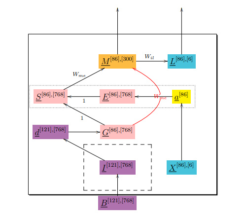
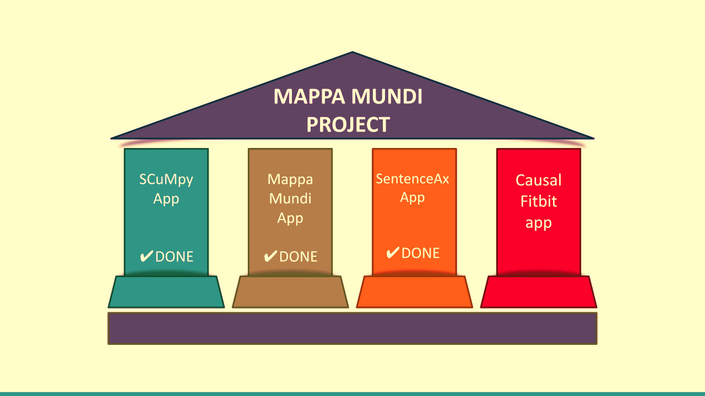

# SentenceAx

The [Openie6 (O6) software](https://github.com/dair-iitd/openie6) 
splits complex or
compound sentences into simple ones. 
Simple sentences are essentially the same 
as the triples (subject, relationship, object) which, 
when visualized as a directed or undirected graph, 
is called a “knowledge graph”. 
Sentence splitting is also a necessary step 
in doing causal DAG extraction from text (causal DEFT), 
as is done by my software [Mappa Mundi](https://github.com/rrtucci/mappa_mundi).

SentenceAx (Sax) is a complete rewrite, from stem to stern, of O6.

SentenceAx is a fine-tuning of BERT written in PyTorch and Lightning.

SentenceAx is a stand-alone app, but, just like the
SCuMpy app,
it's also 
a key component of the 
Mappa Mundi Project which started with the
MappaMundi app.
The SentenceAx app, SCuMpy app and Mappa Mundi app were
written by
www.ar-tiste.xyz

* [Mappa Mundi Project](https://qbnets.wordpress.com/2023/07/31/searching-for-causal-pathways-for-diseases-using-an-individuals-fitbit-and-social-media-records-part-2/)
    * [MappaMundi app](https://github.com/rrtucci/mappa_mundi)
    * [SCuMpy app](https://github.com/rrtucci/scumpy)
    * SentenceAx (this repo)
    * Causal Fitbit (coming soon)

## Input Dataset and Weight

Due to a < 50MB per file limitation at Github, 
the input datasets ad weights will be located at HuggingFace, at 
[this location](https://huggingface.co/datasets/rrtucci/SentenceAx).

Download and unzip the zipped files at that loccation. Use them to replace the 
directories called `input_files` and  `weights` in your local copy of 
SentenceAx.

## Documentation

* [My blog posts about SentenceAx](https://qbnets.wordpress.com/?s=SentenceAx)

* Chapter entitled ``[Sentence Splitting with SentenceAx](https://github.com/rrtucci/Bayesuvius/raw/master/sentence-ax-chapter.pdf)" in my free open 
  source
book Bayesuvius 
* [Appendix](https://github.com/rrtucci/SentenceAx/raw/master/documentation/sentence-ax-appendix.pdf) to the Chapter in Bayesuvius